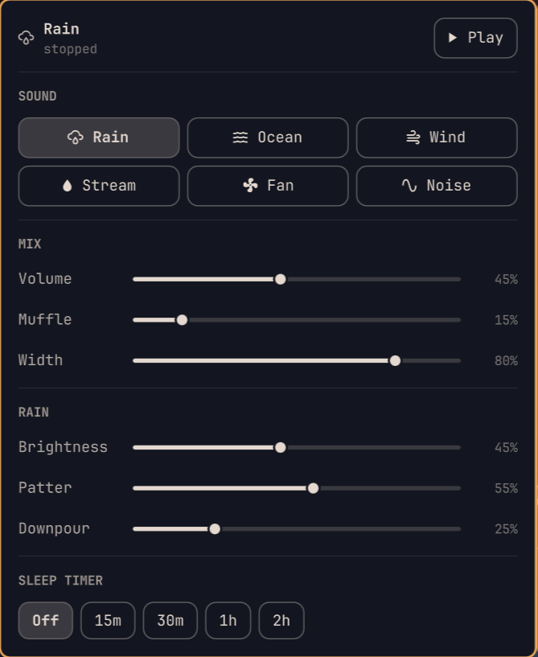

# Noisebox

Background noise for [Omarchy](https://omarchy.org/), generated live in the bar.
Rain, ocean, wind, a stream, a fan, and plain white/pink/brown noise — each with
sliders to dial it in.

**There are no sound files.** Every sound is synthesised from shaped noise as it
plays, which is why the whole plugin is a few hundred kilobytes and why the
sliders change the sound instantly instead of crossfading between loops.



## Install

Review the repository, then add the plugin:

```bash
omarchy plugin add https://github.com/YOUR-GITHUB-USERNAME/omarchy-noisebox.git
```

Accept the prompt to enable the plugin during installation.

For an unattended install from a repository you already trust:

```bash
omarchy plugin add https://github.com/YOUR-GITHUB-USERNAME/omarchy-noisebox.git --enable --yes
```

### Requirements

- **`python-numpy`** — the synthesiser needs it and will not start without it:
  ```bash
  omarchy pkg add python-numpy
  ```
- **PipeWire** (`pw-cat`), which Omarchy already ships. `paplay` is used as a
  fallback if `pw-cat` is missing.

## Using it

The widget lands in the right-hand section of the bar.

| Action | What it does |
| --- | --- |
| Left click | Open the mixer |
| Right click | Start / stop |
| Middle click | Next sound |
| Scroll | Volume |

Every sound keeps its own slider positions, so switching from Rain to Ocean and
back returns the rain you had tuned. **Muffle** rolls the top end off everything
(good for "through a wall"), **Width** sets how wide the stereo image is, and the
**sleep timer** fades out over its last 90 seconds rather than cutting.

### Optional keybindings

Keybindings stay user-owned. Add these to `~/.config/hypr/bindings.lua` if you
want them:

```lua
o.bind("SUPER + N",       "Noisebox mixer",       "omarchy-shell wyatt.noisebox mixer")
o.bind("SUPER + ALT + N", "Noisebox: toggle",     "omarchy-shell wyatt.noisebox toggle")
o.bind("SUPER + ALT + M", "Noisebox: next sound", "omarchy-shell wyatt.noisebox next")
```

The IPC endpoints are `mixer`, `toggle`, `next`, `prev`, `louder`, `quieter`.

### From a terminal

The bundled engine is also a CLI, and it shares state with the bar live in both
directions:

```bash
noisebox on|off|toggle
noisebox mode ocean
noisebox set volume=0.4 surf=0.8
noisebox sleep 30
noisebox status
```

It lives at `~/.config/omarchy/plugins/wyatt.noisebox/bin/noisebox`. Symlink it
onto your `PATH` if you want the short command:

```bash
ln -s ~/.config/omarchy/plugins/wyatt.noisebox/bin/noisebox ~/.local/bin/noisebox
```

## What it does on your system

- **Runs a background process.** `bin/noisebox daemon`, started on demand and
  exiting with your session. It holds the audio stream so sound survives a shell
  reload. Idle when stopped; roughly 1.5% of one core and ~40 MB while playing.
- **Executes** `pw-cat` (or `paplay`) to play audio, and `python3` to run itself.
- **Writes** `~/.config/noisebox/config.json` — your slider positions. Nothing
  else on disk is touched.
- **Listens** on a unix socket at `$XDG_RUNTIME_DIR/noisebox.sock`, used by the
  bar widget and the CLI. It is not a network socket.
- **No network access at all.**
- **Never starts playing on its own.** Playback state is deliberately not
  restored, so a reboot is silent.

## How the sound is made

Each 21 ms the engine draws a frame of random noise, multiplies it by a target
spectral shape, inverse-FFTs it, and overlap-adds it with a square-root Hann
window. That window sums to constant power at 50% overlap, so changing the shape
between frames is a free crossfade — which is what lets you drag a slider
mid-playback without hearing a click.

Rain and surf are then a matter of choosing the right shape and moving it: ocean
gets a slow swell envelope that also opens the filter at the crest (so the foam
arrives with the wave), wind gets a wandering resonance, and rain gets a layer of
individually synthesised droplets sprinkled by a Poisson process, which is what
turns hiss into rain.

## Update

```bash
omarchy plugin update wyatt.noisebox
```

## Validate from source

```bash
omarchy plugin validate .
```

## Security

This plugin runs unsandboxed inside `omarchy-shell` when enabled, and it starts a
background Python process. Review its source and the documented command, file,
and socket behaviour before installing it.

## License

MIT — see [LICENSE](LICENSE).
